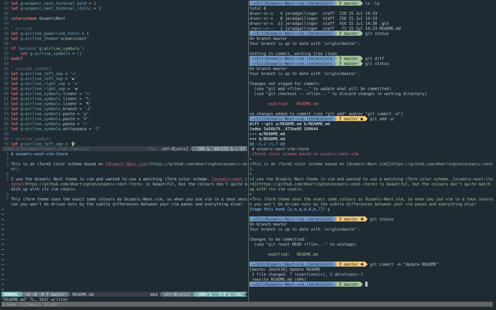

# oceanic-next-vim-iterm

This is an iTerm2 color scheme based on [Oceanic-Next.vim](https://github.com/mhartington/oceanic-next).

I use the Oceanic Next theme in vim and wanted to use a matching iTerm color scheme. [oceanic-next-iterm](https://github.com/mhartington/oceanic-next-iterm) is beautiful, but the colours don't quite match up with its vim cousin.

This iTerm theme uses the exact same colours as Oceanic-Next.vim, so when you use vim in a tmux session you won't be driven nuts by the subtle differences between your vim panes and everything else!

## Screenshot

